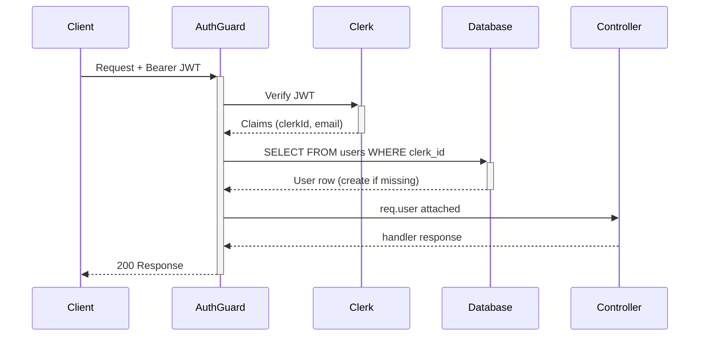

import { Callout } from 'fumadocs-ui/components/callout';

# Authentication & Authorization

## Authentication

Linea uses **Clerk** for authentication. The frontend obtains a short-lived JWT from Clerk and passes it as a `Bearer` token on every API request.

```
Authorization: Bearer <clerk-jwt>
```

### AuthGuard

Every protected route uses `AuthGuard` (applied globally via `APP_GUARD`). It:

1. Extracts the JWT from the `Authorization` header
2. Verifies it with Clerk's public key (`@clerk/backend`)
3. Reads the `sub` claim (Clerk user ID)
4. Looks up or creates a `users` row keyed by `clerkId`
5. Attaches the full `User` record to `req.user`

If the token is missing or invalid, `AuthGuard` throws `401 Unauthorized`.



## Authorization Layers

### WorkspaceGuard

Reads `:workspaceId` from route params, checks `workspace_members`, and attaches:

- `req.workspace` — the `Workspace` row
- `req.membership` — the `WorkspaceMember` row (includes `role`)

Returns `404` if the workspace doesn't exist, `403` if the user isn't a member.

### SpaceGuard

Reads `:spaceId` from route params, verifies `spaces.workspaceId = req.workspace.id`, and attaches:

- `req.space` — the `Space` row

Returns `404` if the space doesn't exist or belongs to a different workspace.

### Role Checks

Some service methods enforce minimum roles:

| Action | Minimum Role |
|--------|-------------|
| Create workflow | `editor` |
| Delete workflow (soft) | `editor` |
| Restore workflow | `editor` |
| Update workspace settings | `admin` |
| Delete space | `admin` |
| Invite members | `admin` |
| Create API key | `admin` |

Role hierarchy: `viewer < editor < admin < owner`

## API Keys (Machine Auth)

For programmatic access, Linea supports workspace-scoped **Linea API Keys** (prefixed `lin_`). These bypass Clerk and authenticate via a custom header or bearer token checked by `ApiKeyGuard`.

<Callout>
  API keys are stored as SHA-256 hashes. The raw key is shown once at creation time and never retrievable again.
</Callout>

## Decorators

| Decorator | Source | Description |
|-----------|--------|-------------|
| `@CurrentUser()` | `current-user.decorator.ts` | Extracts `req.user` |
| `@CurrentWorkspace()` | `current-workspace.decorator.ts` | Extracts `req.workspace` |
| `@CurrentMembership()` | `current-membership.decorator.ts` | Extracts `req.membership` |
| `@Public()` | `public.decorator.ts` | Skips `AuthGuard` |
