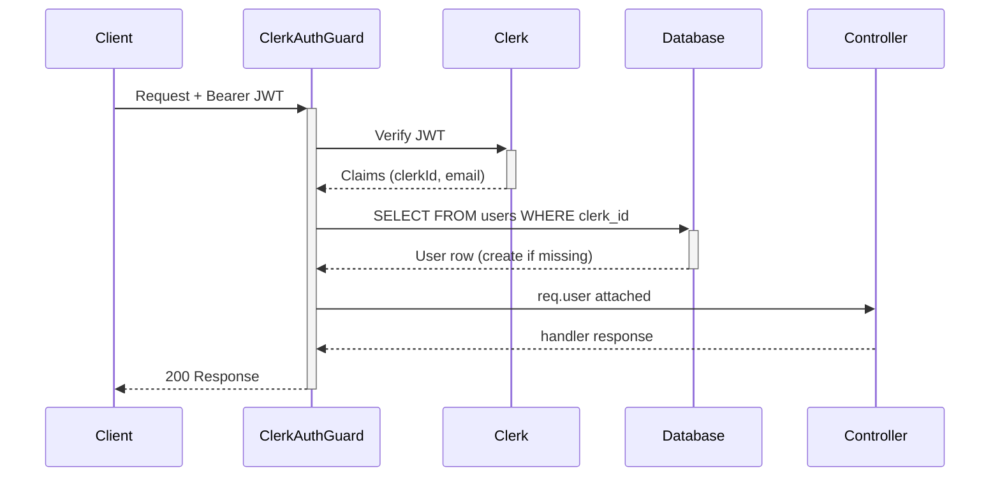

import { Callout } from 'fumadocs-ui/components/callout';

# Authentication & Authorization

## Authentication

Linea uses **Clerk** for authentication. The frontend obtains a short-lived JWT from Clerk and passes it as a `Bearer` token on every API request.

```
Authorization: Bearer <clerk-jwt>
```

### ClerkAuthGuard

Every protected route uses `ClerkAuthGuard` (applied globally via `APP_GUARD`). It:

1. Extracts the `Bearer` token from the `Authorization` header
2. Checks if the token starts with `lnk_` — if so, it's a Linea API key (see below)
3. Otherwise, verifies the JWT with Clerk's public key (`@clerk/backend`)
4. Reads the `sub` claim (Clerk user ID)
5. Looks up or creates a `users` row keyed by `clerkId`
6. Attaches the full `User` record to `req.user`

If the token is missing or invalid, `ClerkAuthGuard` throws `401 Unauthorized`.



## Authorization Layers

### WorkspaceGuard

Reads `:workspaceId` from route params, checks `workspace_members`, and attaches:

- `req.workspace`: the `Workspace` row
- `req.membership`: the `WorkspaceMember` row (includes `role`)

Returns `404` if the workspace doesn't exist, `403` if the user isn't a member.

### PodGuard

Reads `:podId` from route params, verifies `pods.workspaceId = req.workspace.id`, and attaches:

- `req.pod`: the `Pod` row

Returns `404` if the pod doesn't exist or belongs to a different workspace.

### Role Checks

Some service methods enforce minimum roles:

| Action | Minimum Role |
|--------|-------------|
| Create workflow | `editor` |
| Delete workflow (soft) | `editor` |
| Restore workflow | `editor` |
| Update workspace settings | `admin` |
| Delete pod | `admin` |
| Invite members | `admin` |
| Create API key | `admin` |

Role hierarchy: `viewer < editor < admin < owner`

## API Keys (Machine Auth)

For programmatic access, Linea supports workspace-scoped **Linea API Keys** (prefixed `lnk_`). These are passed as a Bearer token and handled by `ClerkAuthGuard` before the Clerk JWT path:

```
Authorization: Bearer lnk_<key>
```

<Callout>
  API keys are stored as SHA-256 hashes. The raw key is shown once at creation time and never retrievable again.
</Callout>

## Clerk Org Sync

When a Clerk organization is created or membership changes, Clerk fires webhook events to `/auth/webhooks/clerk`. The `ClerkWebhookController` handles:

| Event | Action |
|-------|--------|
| `organization.created` | `WorkspacesService.upsertFromClerkOrg()` — creates/updates workspace keyed by `clerkOrgId` |
| `organizationMembership.created` | `WorkspacesService.addMemberFromClerk()` — upserts `workspace_members` |
| `organizationMembership.deleted` | `WorkspacesService.removeMemberFromClerk()` — deletes `workspace_members` entry |

## Decorators

| Decorator | Source | Description |
|-----------|--------|-------------|
| `@CurrentUser()` | `current-user.decorator.ts` | Extracts `req.user` |
| `@CurrentWorkspace()` | `current-workspace.decorator.ts` | Extracts `req.workspace` |
| `@WorkspaceMembership()` | `workspace-membership.decorator.ts` | Extracts `req.membership` |
| `@Public()` | `public.decorator.ts` | Skips `ClerkAuthGuard` |
