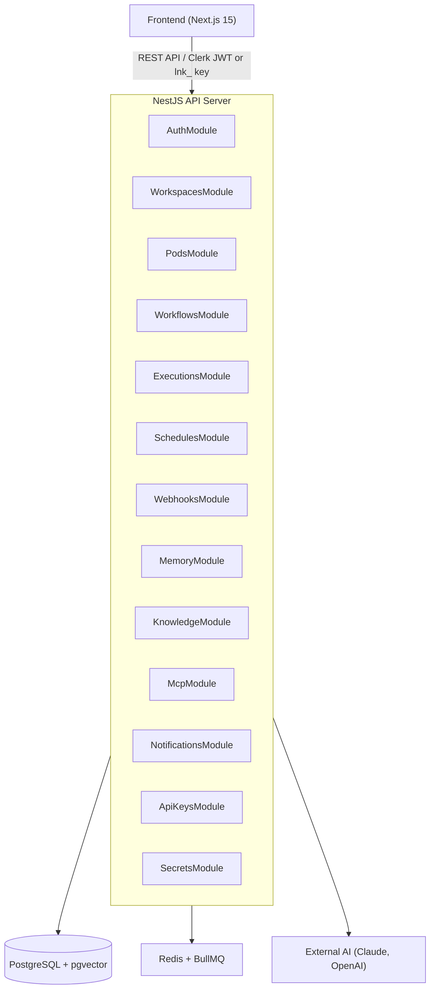

# System Overview

Linea is a multi-tenant workflow automation platform. Its backend is a NestJS monolith divided into feature modules, backed by PostgreSQL with pgvector, and a BullMQ job queue over Redis.

## Component Diagram

## Request Lifecycle

1. **Frontend** calls the API with a `Bearer` token (Clerk JWT or `lnk_` API key)
2. **ClerkAuthGuard** validates the token and resolves the `User` record via `clerkId`
3. **WorkspaceGuard** checks `workspace_members` and attaches `req.workspace` + `req.membership`
4. **PodGuard** (for pod-scoped routes) verifies the pod belongs to the workspace and attaches `req.pod`
5. **Controller** delegates to a **Service** which queries via Drizzle ORM
6. For workflow execution: the service enqueues a BullMQ job; a **Worker** picks it up and processes it asynchronously via LangGraph

## Module Boundary Rules

- Each NestJS module owns exactly one domain (e.g., `WorkflowsModule` only touches `workflows` table)
- Cross-module reads go through exported services, never direct table access from another module
- The `DatabaseModule` is global; all modules receive the Drizzle client via `@Inject(DB_TOKEN)`
- `PodsModule` exports `PodsService` and `PodGuard`; it is imported by `WorkflowsModule`, `ExecutionsModule`, `SchedulesModule`, `WebhooksModule`

## Error Handling

All service methods throw NestJS built-in exceptions (`NotFoundException`, `ForbiddenException`, etc.). Guards return structured `401`/`403`/`404` before the controller is reached. Unhandled errors are caught by NestJS's global exception filter.
