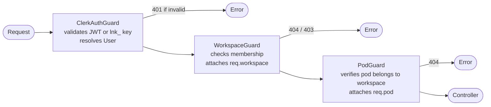

import { Callout } from 'fumadocs-ui/components/callout';

# Workspace & Pod Model

Linea uses a **two-level hierarchy** to organise resources:

```
Workspace (org / team)
└── Pod (project / environment)
    ├── Workflows
    ├── Executions
    ├── Schedules
    └── Webhooks
```

Resources that are **workspace-wide** (shared across all pods):

- API Keys & Secrets
- MCP Servers
- Memories & Knowledge Bases
- Resource Pools & Quotas
- Members, Invites, Audit Logs

## Workspace

A **Workspace** maps to an organisation or team. It is the billing and membership boundary.

| Column | Type | Notes |
|--------|------|-------|
| `id` | UUID PK | |
| `name` | text | Display name |
| `slug` | text | URL-safe unique identifier |
| `plan` | enum | `free \| pro \| enterprise` |
| `clerkOrgId` | text | Clerk organisation ID (unique) — used to sync org membership events |
| `createdAt` | timestamp | |

Membership is tracked in `workspace_members` with roles: `owner`, `admin`, `editor`, `viewer`.

## Pod

A **Pod** is a logical grouping of workflows inside a workspace: analogous to a project or environment (e.g., *Production*, *Staging*, *Research*).

| Column | Type | Notes |
|--------|------|-------|
| `id` | UUID PK | |
| `workspaceId` | UUID FK → workspaces | Cascade delete |
| `name` | text | |
| `slug` | text | Unique within workspace |
| `description` | text | Optional |

### Authorization

Pods **inherit workspace membership**: there are no separate pod-level roles. If you are a member of the workspace, you can access all its pods. The `PodGuard` only verifies that the requested `podId` belongs to the current `workspaceId`.

## API Route Structure

All pod-scoped endpoints follow this pattern:

```
/v1/workspaces/:workspaceId/pods/:podId/workflows
/v1/workspaces/:workspaceId/pods/:podId/executions
/v1/workspaces/:workspaceId/pods/:podId/schedules
/v1/workspaces/:workspaceId/pods/:podId/webhooks
```

Pod management endpoints:

```
POST   /v1/workspaces/:workspaceId/pods
GET    /v1/workspaces/:workspaceId/pods
GET    /v1/workspaces/:workspaceId/pods/:podId
PATCH  /v1/workspaces/:workspaceId/pods/:podId
DELETE /v1/workspaces/:workspaceId/pods/:podId
```

Workspace-level endpoints omit the pod segment:

```
/v1/workspaces/:workspaceId/secrets
/v1/workspaces/:workspaceId/knowledge
/v1/workspaces/:workspaceId/mcp-servers
/v1/workspaces/:workspaceId/api-keys
```

## Guard Chain



<Callout type="warn">
  `PodGuard` must always run after `WorkspaceGuard` because it reads `workspaceId` from route params to scope the pod lookup.
</Callout>

## Executions: Why They Keep `workspaceId`

`executions` has **both** `podId` and `workspaceId`. The execution engine needs `workspaceId` directly to:

- Resolve API keys for outbound calls
- Track resource quotas
- Look up MCP servers

Without it, every execution job would need an extra JOIN through `pods` (expensive at high throughput). `podId` is set when the execution is created via any trigger (schedule, webhook, or manual).
