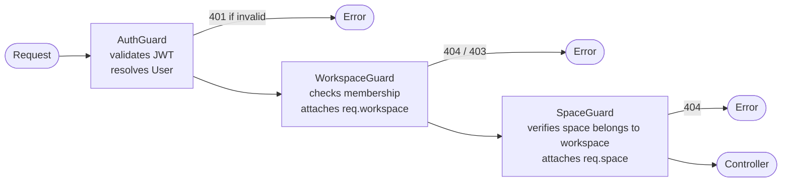

import { Callout } from 'fumadocs-ui/components/callout';

# Workspace & Space Model

Linea uses a **two-level hierarchy** to organise resources:

```
Workspace (org / team)
└── Space (project / environment)
    ├── Workflows
    ├── Executions
    ├── Schedules
    └── Webhooks
```

Resources that are **workspace-wide** (shared across all spaces):

- API Keys & Secrets
- MCP Servers
- Memories & Knowledge Bases
- Resource Pools & Quotas
- Members, Invites, Audit Logs

## Workspace

A **Workspace** maps to an organisation or team. It is the billing and membership boundary.

| Column | Type | Notes |
|--------|------|-------|
| `id` | UUID PK | |
| `name` | text | Display name |
| `slug` | text | URL-safe unique identifier |
| `plan` | enum | `free \| pro \| enterprise` |
| `createdAt` | timestamp | |

Membership is tracked in `workspace_members` with roles: `owner`, `admin`, `editor`, `viewer`.

## Space

A **Space** is a logical grouping of workflows inside a workspace: analogous to a project or environment (e.g., *Production*, *Staging*, *Research*).

| Column | Type | Notes |
|--------|------|-------|
| `id` | UUID PK | |
| `workspaceId` | UUID FK → workspaces | Cascade delete |
| `name` | text | |
| `slug` | text | Unique within workspace |
| `description` | text | Optional |

### Authorization

Spaces **inherit workspace membership**: there are no separate space-level roles. If you are a member of the workspace, you can access all its spaces. The `SpaceGuard` only verifies that the requested `spaceId` belongs to the current `workspaceId`.

## API Route Structure

All space-scoped endpoints follow this pattern:

```
/v1/workspaces/:workspaceId/spaces/:spaceId/workflows
/v1/workspaces/:workspaceId/spaces/:spaceId/executions
/v1/workspaces/:workspaceId/spaces/:spaceId/schedules
/v1/workspaces/:workspaceId/spaces/:spaceId/webhooks
```

Workspace-level endpoints omit the space segment:

```
/v1/workspaces/:workspaceId/memories
/v1/workspaces/:workspaceId/knowledge
/v1/workspaces/:workspaceId/mcp-servers
/v1/workspaces/:workspaceId/api-keys
```

## Guard Chain



<Callout type="warn">
  `SpaceGuard` must always run after `WorkspaceGuard` because it reads `req.workspace` to scope the space lookup.
</Callout>

## Executions: Why They Keep `workspaceId`

`executions` has **both** `spaceId` and `workspaceId`. The execution engine needs `workspaceId` directly to:

- Resolve API keys for outbound calls
- Track resource quotas
- Look up MCP servers

Without it, every execution job would need an extra JOIN through `spaces` (expensive at high throughput). `spaceId` is nullable and is written when the execution is created via a trigger (schedule, webhook, or manual).
