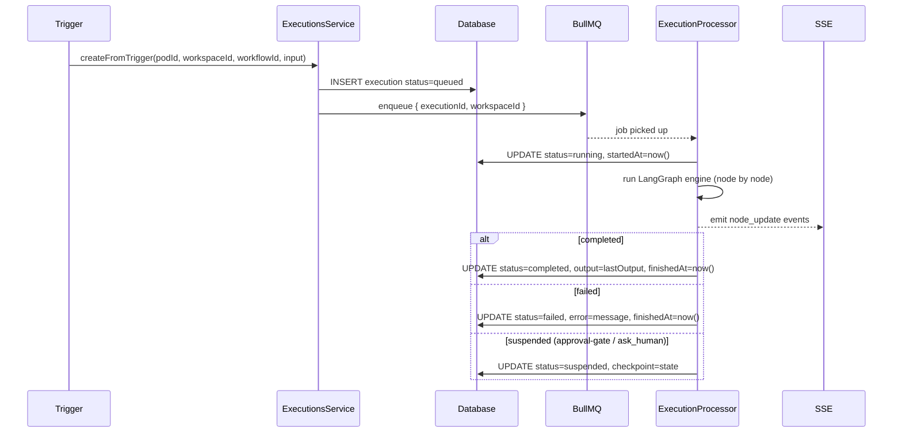

import { Callout } from 'fumadocs-ui/components/callout';

# Executions

An **Execution** is a single run of a workflow. It tracks status, timing, node-level results, input/output, and the LangGraph checkpoint needed to resume suspended runs.

## Schema

```typescript
executions: {
  id: uuid PK
  workspaceId: uuid FK → workspaces      // denormalized for worker performance
  podId: uuid FK → pods (set null on delete)
  workflowId: uuid FK → workflows (set null on delete)
  status: enum('queued','running','suspended','completed','failed','cancelled')
  triggeredBy: enum('manual','schedule','webhook','sdk')
  input: jsonb          // trigger payload
  output: jsonb | null  // final result (lastOutput at end node)
  error: text | null    // error message on failure
  nodeResults: jsonb    // per-node { status, output, error, durationMs } map
  variables: jsonb      // LangGraph state snapshot
  checkpoint: jsonb     // LangGraph checkpoint for resume after suspension
  threadId: text        // for multi-turn conversations
  queueJobId: text      // BullMQ job ID
  startedAt: timestamp | null
  finishedAt: timestamp | null
  createdAt: timestamp
}

execution_logs: {
  id: uuid PK
  executionId: uuid FK → executions (cascade delete)
  nodeId: text
  level: enum('debug','info','warn','error')
  message: text
  data: jsonb           // { output, error }
  durationMs: integer | null
  attempt: integer
  timestamp: timestamp
}
```

## Execution Flow



## BullMQ Queue

Executions run asynchronously via a dedicated BullMQ queue named `executions`.

```typescript
// Job payload
interface ExecutionJobData {
  executionId: string
  workspaceId: string   // pre-loaded to avoid JOIN overhead in the worker
}
```

`workspaceId` is stored directly on the `executions` row so the worker never needs to JOIN through `pods` or `workspaces` to resolve credentials.

## Status Transitions

```
queued → running → completed
                → failed
                → suspended → running (on resume)
         running → cancelled (best-effort)
```

<Callout type="warn">
  Cancellation is only reliable for executions in `queued` status. Once the worker has picked up the job (`running`), cancellation is best-effort and depends on where the engine is in the node graph.
</Callout>

## Triggers

### Manual

`POST /workspaces/:wId/pods/:podId/executions`

```json
{ "workflowId": "wf_abc123", "input": { "key": "value" } }
```

Requires `editor` role or above.

### Schedule

`SchedulesService.fireDueSchedules()` runs on a cron tick and calls `createFromTrigger(podId, workspaceId, workflowId, 'schedule', {})`.

### Webhook

`WebhooksService.trigger(webhookId, payload)` fetches the webhook row and calls `createFromTrigger` with the incoming HTTP payload.

### SDK

The TypeScript SDK calls `POST /executions` with `triggeredBy: 'sdk'`. See the [SDK docs](/docs/modules/sdk).

## API Endpoints

| Method | Path | Description |
|--------|------|-------------|
| `POST` | `/workspaces/:wId/pods/:podId/executions` | Trigger manually (editor+) |
| `GET` | `/workspaces/:wId/pods/:podId/executions` | List (supports `?status=`, `?workflowId=`) |
| `GET` | `/workspaces/:wId/pods/:podId/executions/:id` | Get execution detail |
| `GET` | `/workspaces/:wId/pods/:podId/executions/:id/logs` | Get structured logs |
| `GET` | `/workspaces/:wId/pods/:podId/executions/:id/events` | SSE stream (see below) |
| `PATCH` | `/workspaces/:wId/pods/:podId/executions/:id/respond` | Respond to suspended execution |
| `PATCH` | `/workspaces/:wId/pods/:podId/executions/:id/approve` | Approve suspended execution |
| `POST` | `/workspaces/:wId/pods/:podId/executions/:id/replay` | Replay from the start or from a specific node |
| `DELETE` | `/workspaces/:wId/pods/:podId/executions/:id` | Cancel execution (editor+) |

## SSE Event Streaming

`GET /workspaces/:wId/pods/:podId/executions/:id/events`

The SSE stream emits one event per node state change. The stream auto-closes after **10 minutes**.

```typescript
// node_update: emitted as each node starts, completes, fails, or suspends
{
  type: 'node_update'
  nodeId: string
  status: 'running' | 'completed' | 'failed' | 'suspended'
  output?: unknown      // present when status === 'completed'
  error?: string        // present when status === 'failed'
  durationMs?: number
}

// execution_complete: emitted when the end node is reached
{ type: 'execution_complete'; status: 'completed'; output: unknown }

// execution_failed: emitted on unrecoverable error
{ type: 'execution_failed'; error: string }

// execution_suspended: emitted when an approval-gate or ask_human fires
{ type: 'execution_suspended'; interrupt: unknown }
```

Use the TypeScript SDK's `streamEvents()` to consume this — it handles reconnection automatically. See [TypeScript SDK](/docs/modules/sdk).

## Resuming Suspended Executions

When an execution is suspended (status `suspended`), resume it by submitting a response:

```
PATCH /workspaces/:wId/pods/:podId/executions/:id/respond
```

```json
{ "approved": true }
```

or with a reason for rejection:

```json
{ "approved": false, "reason": "Not authorized to proceed" }
```

The LangGraph checkpoint stored in `execution.checkpoint` is used to resume the graph from exactly the point it was interrupted.

## Replay

```
POST /workspaces/:wId/pods/:podId/executions/:id/replay
```

```json
{ "fromNodeId": "node_abc" }
```

Omit `fromNodeId` to replay from the beginning with the original input.

## Frontend

Executions are visible at the pod level in the dashboard. The detail page includes a live node graph that highlights each node as it runs, a log stream, and Approve/Reject buttons for suspended executions.
