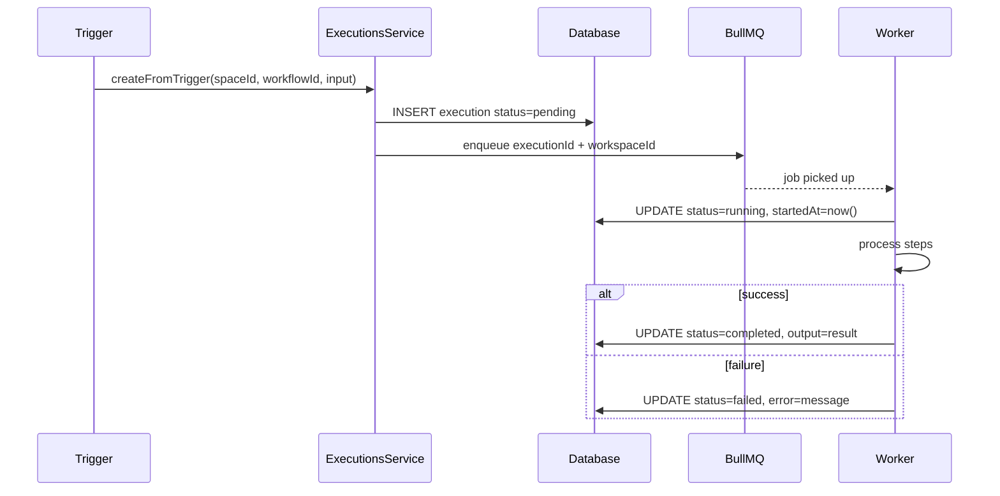

import { Callout } from 'fumadocs-ui/components/callout';

# Executions

An **Execution** is a single run of a workflow. It tracks status, timing, input/output, and error information across its steps.

## Schema

```typescript
executions: {
  id: uuid PK
  workspaceId: uuid FK → workspaces  // kept for engine performance
  spaceId: uuid FK → spaces (set null on delete)
  workflowId: uuid FK → workflows (set null on delete)
  status: enum('pending','running','completed','failed','cancelled')
  triggeredBy: enum('manual','schedule','webhook','api')
  input: jsonb          // trigger payload
  output: jsonb | null  // final result
  error: text | null
  startedAt: timestamp | null
  completedAt: timestamp | null
  createdAt: timestamp
}
```

## Execution Flow



## BullMQ Integration

The execution engine uses a dedicated BullMQ queue (`executions`). The `ExecutionsWorker` processes jobs asynchronously with configurable concurrency.

```typescript
// Job payload
interface ExecutionJob {
  executionId: string
  workspaceId: string   // pre-loaded to avoid JOIN on every job
}
```

`workspaceId` is stored directly on `executions` so the worker never needs to JOIN through `spaces` to resolve API keys or resource quotas.

## Triggers

### Schedule

`SchedulesService.fireDueSchedules()` runs on a cron tick, JOINs `spaces` to get `workspaceId`, and calls `createFromTrigger(spaceId, workspaceId, workflowId, 'schedule', {})`.

### Webhook

`WebhooksService.trigger(webhookId, payload)` fetches the webhook row, JOINs `spaces` for `workspaceId`, and calls `createFromTrigger(spaceId, workspaceId, workflowId, 'webhook', payload)`.

### Manual / API

Direct call to `POST /workspaces/:wId/spaces/:sId/executions` with optional `input` payload.

## API Endpoints

| Method | Path | Description |
|--------|------|-------------|
| `GET` | `/workspaces/:wId/spaces/:sId/executions` | List (supports `?status=`, `?workflowId=`) |
| `POST` | `/workspaces/:wId/spaces/:sId/executions` | Trigger manually |
| `GET` | `/workspaces/:wId/spaces/:sId/executions/:id` | Get execution detail |
| `POST` | `/workspaces/:wId/spaces/:sId/executions/:id/cancel` | Cancel pending execution |

## Status Transitions

```
pending → running → completed
                 → failed
         running → cancelled (best-effort)
```

<Callout type="warn">
  Cancellation only works reliably for executions in `pending` status. Once a worker has started processing (`running`), cancellation is a best-effort signal.
</Callout>

## SSE Event Streaming

Running executions emit Server-Sent Events on:

```
GET /workspaces/:wId/spaces/:sId/executions/:id/events
```

Events are JSON objects with the following shapes:

```typescript
{ type: 'node_update'; nodeId: string; status: 'running'|'completed'|'failed'|'suspended'; output?: unknown; error?: string }
{ type: 'execution_complete'; status: string; output: unknown }
{ type: 'execution_failed'; error: string }
{ type: 'execution_suspended'; interrupt: unknown }
```

Use the TypeScript SDK to consume this stream — see [TypeScript SDK](/docs/modules/sdk).

## Frontend

The executions page lives at `/spaces/[spaceId]/executions`. It displays a table with live status badges and links to individual execution detail pages at `/spaces/[spaceId]/executions/[id]`. The detail page includes an "Open in builder" button that navigates directly to the workflow builder.
